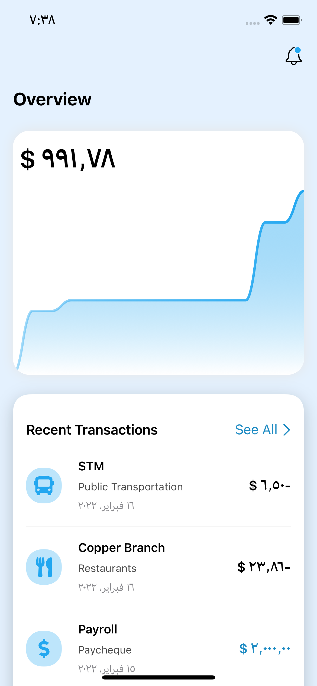
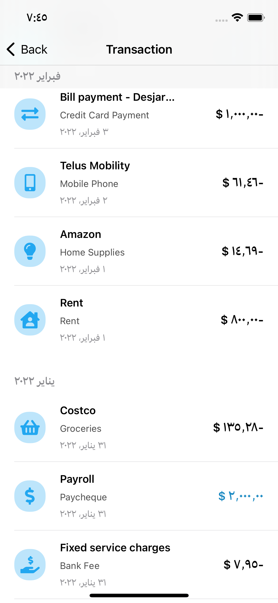
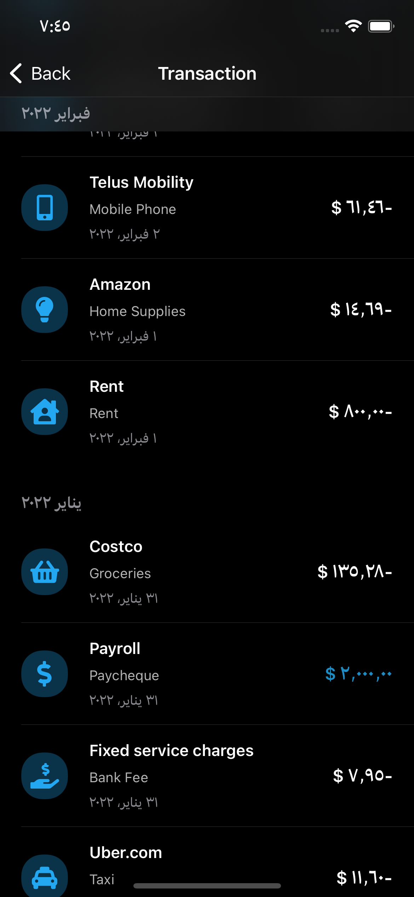

#  ExpenseTracker
The main goal of this app is Tracking Your financial transaction (debit and credit)

# description 
The main view contines two sections (Chart and last five Transactions)

## Chart
using SwiftUICharts package i implemnts chart showing user his/her financial transaction (debit and credit)

in next section 
## last Transaction user will see recent transactions

# you can see all transctions sorted by month 

## Also app work with dark mood 

# importent notes 
you need to provide a json file for your transaction that contines some importent attrubtue 
like : date , institution , amount(debit and credit) , category 
and other atturabte 
you will see it in TransactionModel file 

